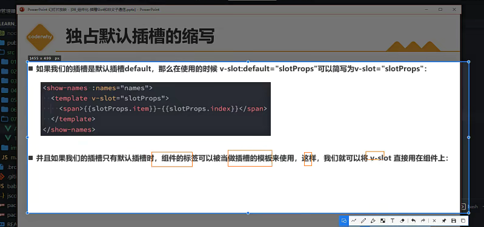
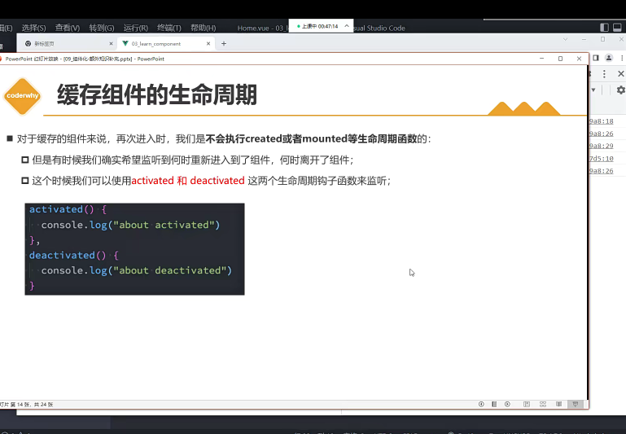

# 01_product_demo

## Project setup
```
npm install
```

### Compiles and hot-reloads for development
```
npm run serve
```

### Compiles and minifies for production
```
npm run build
```

### Customize configuration
See [Configuration Reference](https://cli.vuejs.org/config/).
1.node_modules：项目的依赖文件夹

2.public：用于存放项目使用到的一些静态资源（图片）等，在最后webpack打包时会直接放入dist文件夹内。

3.public/index.html:是一个模板文件，作用是生成项目的入口文件，webpack打包的js,css也会自动注入到该页面中。

4.src:程序的源代码文件夹

5.src/assets:一般用于放置src里的组件所使用的静态资源（在webpack打包时会被当成一个模块打包到js文件夹里。

6.src/compnents：一般用于放置非路由组件和全局组件

7.src/router:router -- 配置整个vue项目的路由，vue 是单页面应用的代表，这里面就是设置一个一个组件的地址文件。

8.src/store:放置 vuex 需要的状态关联文件，设置公共的 state、mutations 等；

9.src/views：src/views：用于存放我们写好的各种页面，如login、main等

10.App.vue:项目中唯一的根组件

11.src/main.js:程序的入口文件，项目中第一个执行的文件

12..browserslistrc:是在不同的前端工具之间共用目标浏览器和 node 版本的配置文件。

13..gitignore:用以 设置 Git的忽略规则,被忽略的内容将不被纳入版本管理

14.bable.config.js:项目的配置文件，一般用于兼容es5和es6语法

15.jsconfig.json:记录vue项目的相关信息

16.package-lock.josn:锁定所有模块的版本号，包括主模块和所有依赖子模块。

17package.json.:记录vue项目的相关信息

18.README.md：md文件一般出现在项目的根目录下面，其作用是：对项目的主要信息进行描述。

19.vue.config.js：是一个可选的配置文件，如果项目的 (和 package.json 同级的) 根目录中存在这个文件，那么它会被 @vue/cli-service 自动加载。你也可以使用 package.json 中的 vue 字段，但是注意这种写法需要你严格遵照 JSON 的格式来写。





生命周期流程图


$ref的使用

keep-alive


缓存组件的生命周期
进入活跃状态或者不活跃状态
activated,活跃状态
deactiveted，不活跃状态


webpack打包分包


影响首图渲染速度
异步导入进行分包处理
实现异步组件的方法：
v-model


Options API 与 Composition API(重要)


setup
